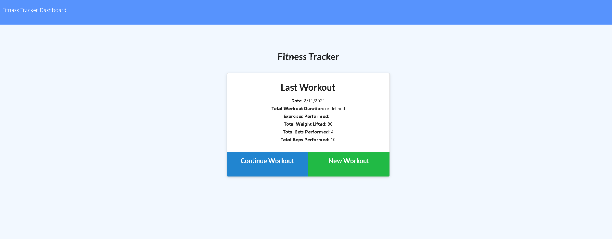

# Fitness_Tracker
Fitness Tracker using MongoDB/Mongoose as back-end database

## Installation:
This project requires installation of npm express and npm mongoose. 

## Usage:
Use this app to store and retrieve workout data. Input new workouts, edit workouts, and view aggregated data about the last 7 workouts. 

## Contributing:
This project is open to contributions.

## To Do:
* There may be some nested objects in the get route on the index view of the last workout.
* Look into the id in the url.
* Change to last 7 days vs. last 7 workouts? Last 7 workouts seemed to mirror dev instructions, but last 7 days might make more sense in real-life use and might render cleaner. 

## License:
MIT License: A short and simple permissive license with conditions only requiring preservation of copyright and license notices. Licensed works, modifications, and larger works may be distributed under different terms and without source code. License descriptions provided by [Choose A License]https://choosealicense.com/)

## Questions:
* GitHub Username: lizlarkin
* lizlarkin GitHub Link
* Email me with addition questions at: enlarkin@gmail.com

## Link to the deployed page
:https://fitnesstrackerlarkin.herokuapp.com/?id=602616c17e1dee2f14bf8719

## Screenshot: 

